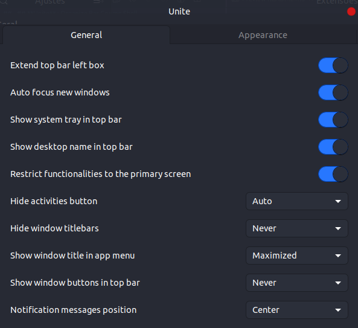
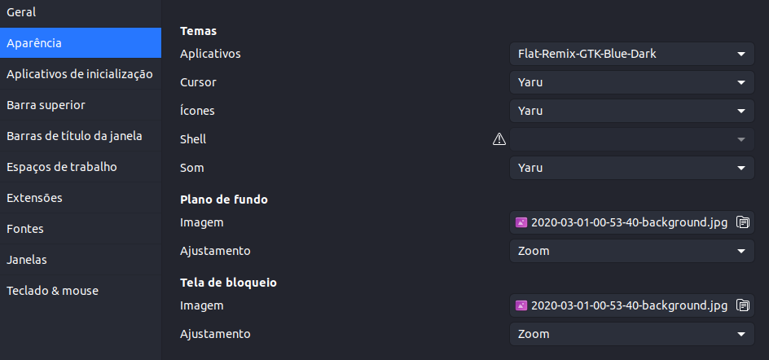

# My Work Setup Dev

- ## Work setup for developing mobile applications in react-native and flutter

# 1. SO

- ## **Ubuntu 20.04**

# 2. Extensions Gnome
*Firts install Gnome Tweaks in Ubuntu*

- **OpenWeather** : *Extension to view weather forecast*

-  **Unite** : *Organize Bar Gnome Shell*

-  **Vitals** : *Monitor System*
*and install*

`sudo apt-get install gir1.2-gtop-2.0 gir1.2-clutter-1.0`

`sudo apt-get install gir1.2-networkmanager01.0`

# 2.a. Appearence Gnome
*Firts install Gnome Tweaks in Ubuntu*

# 3. Aplications Desktop

-  **Browser** : *Brave Web Browser + translate extension*

-  **Music** : *Spotify*

-  **Apis Requests** : *Postman*

-  **Communicate** : *Slack and Discord*

-  **Line Command** : *Terminal Standart Ubuntu*

-  **Emulator Android** : *Genymotion*

-  **Editor Text for Notes** : *Sublime Text*

-  **GUI Client for Git** : *GitKraken*

-  **Video Call** : *Zoom*

-  **IDE for Kotlin / Java** : *IntelliJ*

- ## VS Code Editor Text for Programming
    **Extensions**
    - *Better Comments*
    - *Code Snap*
    - *Color Highlight*
    - *Dart*
    - *Dracula Official*
    - *Error Lens*
    - *ESLint*
    - *Flutter*
    - *GitLents*
    - *JavaScript (ES6) code snippets*
    - *Material Icon Theme*
    - *Pomodoro*
    - *Rainbow Brackets*
    - *Rocketseat React Native*
